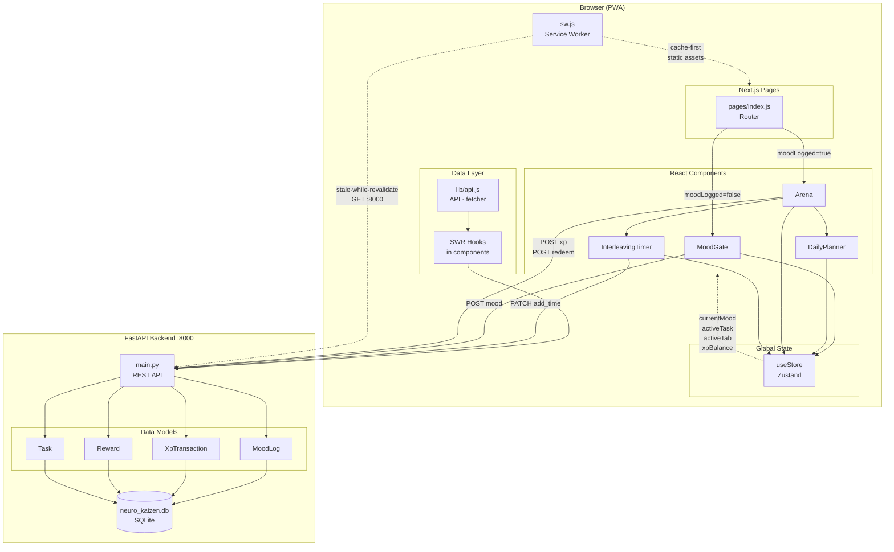

# Neuro-Kaizen — Architecture

> Knowledge-graph source: GitNexus index `Mile` (118 symbols, 1 cluster, 1 traced execution flow).
> Last indexed: 2026-03-31.

---

## Overview

Neuro-Kaizen is a gamified productivity PWA ("mental exoskeleton"). It adapts daily tasks to the user's self-reported energy level, tracks deep-work sessions via a Pomodoro-style interleaving timer, and rewards focused work with an XP economy.

The system is split into two independently running processes:

| Layer | Stack | Port |
|---|---|---|
| **Frontend** | Next.js 15 (Pages Router) · Tailwind v4 · Zustand · SWR | 3000 |
| **Backend** | FastAPI · SQLModel · SQLite | 8000 |

Communication is over plain HTTP REST. No authentication layer exists — the app is designed for single-user local use.

---

## Functional Areas

### 1. PWA Shell
**Files:** [pages/_document.js](pages/_document.js), [pages/_app.js](pages/_app.js), [public/sw.js](public/sw.js), [public/manifest.json](public/manifest.json)

The service worker implements two caching strategies:
- **Stale-While-Revalidate** for all `GET` requests to port 8000 (API data stays usable offline)
- **Cache-first** for static Next.js assets

The manifest sets `display: standalone` so the app installs as a native-like PWA on mobile.

---

### 2. Entry Point & Routing
**Files:** [pages/index.js](pages/index.js)

Single-page app with a mood gate. The entire routing decision is one line:

```js
return moodLogged ? <Arena /> : <MoodGate />
```

The service worker is registered here on mount.

---

### 3. Mood Gate
**Files:** [components/MoodGate.js](components/MoodGate.js)

The mandatory daily check-in. Presents 5 energy levels (1 = Épuisé → 5 = En feu) as battery-icon pills. On selection:
1. POST `/api/mood` (fire-and-forget — offline failure is silenced)
2. `useStore.setMood(score)` triggers re-render to Arena

The mood score stored in Zustand gates which Arena tasks are shown (`minMood` filter on `ALL_TASKS`).

---

### 4. Global State
**Files:** [store/useStore.js](store/useStore.js)

Zustand store — single source of truth for all cross-component state:

| Key | Type | Purpose |
|---|---|---|
| `moodLogged` | boolean | Controls MoodGate vs Arena routing |
| `currentMood` | 1–5 | Filters available tasks by energy level |
| `xpBalance` | number | Synced from SWR, used for reward affordability |
| `activeTask` | Task \| null | Passed from Planner to Timer for time tracking |
| `activeTab` | `'timer'` \| `'planner'` | Controls Arena tab switcher |

---

### 5. Arena (Dashboard)
**Files:** [components/Arena.js](components/Arena.js)

The main shell after check-in. Contains:
- **XP balance** display (polled every 4s via SWR)
- **Segmented tab control** (Timer / Planner) — state in Zustand so children can trigger tab switches
- **XP Task list** — filtered by `currentMood`, each button POSTs `/api/xp` on completion
- **Reward shop** — fetched from `/api/rewards`, redeems via POST `/api/rewards/redeem/{id}`

Both `InterleavingTimer` and `DailyPlanner` are **always mounted**. The inactive tab uses Tailwind `hidden` to preserve timer countdown state across tab switches.

---

### 6. Interleaving Timer
**Files:** [components/InterleavingTimer.js](components/InterleavingTimer.js)

25-minute focus / 5-minute break Pomodoro cycle that alternates between two subjects (`Code` / `Design`).

**GitNexus traced execution flow — `InterleavingTimer → Pad`:**
```
InterleavingTimer  →  fmt()  →  pad()
```
`pad` zero-pads a number to 2 digits; `fmt` converts total seconds to `MM:SS`; `InterleavingTimer` drives the SVG ring and countdown display.

On focus phase completion:
1. `PATCH /api/tasks/{activeTask.id}/add_time` — logs 25 minutes on the active task
2. `mutate('/api/tasks')` + `mutate('/api/tasks/completed')` — invalidates Planner lists
3. `onSessionComplete()` callback → Arena POSTs `+50 XP` to `/api/xp`

The ring is drawn with an SVG `stroke-dashoffset` animated at `1s linear` while running.

---

### 7. Daily Planner
**Files:** [components/DailyPlanner.js](components/DailyPlanner.js)

Task manager embedded as the second Arena tab.

**Task creation** captures:
- Title, target minutes, optional reminder time (`datetime-local`)
- Resource URLs via the Smart Clipboard feature: on link-icon click, reads `navigator.clipboard.readText()` (user-gesture gated for iOS Safari compliance) and offers a one-tap pill to accept the URL

**Task rows** show a time-progress bar (`spent_minutes / target_minutes`) and a focus button. Tapping focus:
1. `setActiveTask(task)` — passes task reference to the timer
2. `setActiveTab('timer')` — switches Arena to the timer tab

**Notification scheduling:** `useNotifications` hook schedules `setTimeout`-based Web Notifications for tasks with a `reminder_time`. Permissions are requested on mount.

Task completion is **derived**, not flagged: the backend returns active tasks (`spent < target`) and completed tasks (`spent >= target`) from separate endpoints.

---

### 8. Shared API Layer
**Files:** [lib/api.js](lib/api.js)

```js
export const API = 'http://localhost:8000/api'
export const fetcher = (url) => fetch(url).then((r) => r.json())
```

Single source of the base URL and SWR fetcher — imported by Arena, DailyPlanner, and InterleavingTimer.

---

### 9. Backend — API
**Files:** [main.py](main.py)

FastAPI app with 9 endpoints across 4 resource groups:

| Method | Path | Description |
|---|---|---|
| POST | `/api/mood` | Log daily mood check-in |
| GET | `/api/xp/balance` | Sum all XP transactions |
| POST | `/api/xp` | Record XP transaction (positive or negative) |
| GET | `/api/rewards` | List active rewards |
| POST | `/api/rewards` | Create reward |
| POST | `/api/rewards/redeem/{id}` | Spend XP on a reward |
| POST | `/api/tasks` | Create task |
| GET | `/api/tasks` | Active tasks (`spent < target`) |
| GET | `/api/tasks/completed` | Completed tasks (`spent >= target`) |
| PATCH | `/api/tasks/{id}/add_time` | Add minutes to a task |

XP balance is computed on-the-fly with `SELECT SUM(amount)` — no denormalized balance column. Reward redemption writes a negative XP transaction rather than modifying the reward.

---

### 10. Backend — Data Layer
**Files:** [models.py](models.py), [database.py](database.py)

SQLite database at `./neuro_kaizen.db`. Tables are created via `SQLModel.metadata.create_all` on FastAPI lifespan startup.

**Data models:**

```
MoodLog         id · score(1-5) · timestamp · notes?
XpTransaction   id · amount · reason · timestamp
Reward          id · title · cost · is_active
Task            id · title · resources(JSON text) · target_minutes · spent_minutes
                   · reminder_time? · created_at
```

`Task.resources` stores a JSON-encoded list of URLs as a plain text column (parsed client-side).

---

## Key Execution Flows

### Flow 1 — Daily Startup
```
User opens app
  → pages/index.js registers sw.js
  → moodLogged = false → render MoodGate
  → User selects energy level
  → POST /api/mood (fire-and-forget)
  → useStore.setMood(score) → moodLogged = true
  → render Arena
```

### Flow 2 — Focus Session
```
DailyPlanner: user taps ▶ on a task
  → setActiveTask(task) + setActiveTab('timer')
  → InterleavingTimer shows task title + progress bar
  → User starts 25-min countdown
  → Timer reaches 0
  → PATCH /api/tasks/{id}/add_time { minutes: 25 }
  → mutate('/api/tasks'), mutate('/api/tasks/completed')
  → onSessionComplete() → POST /api/xp { amount: 50 }
  → mutate('/api/xp/balance') → XP badge updates
  → Timer switches to 5-min break phase
```

### Flow 3 — Reward Redemption
```
Arena: user taps reward button (canAfford = true)
  → POST /api/rewards/redeem/{id}
  → Backend: verify balance >= cost
  → INSERT XpTransaction(amount = -cost)
  → mutate('/api/xp/balance') → balance decreases in UI
```

### Flow 4 — Task Completion (automatic)
```
After enough focus sessions: spent_minutes >= target_minutes
  → GET /api/tasks returns task no longer (filtered out)
  → GET /api/tasks/completed returns task
  → Planner moves task row to "Terminées" section (opacity-50)
```

### Flow 5 — Offline Operation
```
API call fails (no backend running)
  → MoodGate: catch(_) silenced → setMood still fires → app continues
  → SWR fetches: stale-while-revalidate returns cached API data
  → XP/task mutations: catch(_) silenced → UI may drift from DB
  → Static assets: served from cache-first bucket
```

---

## Architecture Diagram



---

## Dependency Graph (simplified)

```
pages/index.js
├── store/useStore        (Zustand global state)
├── components/MoodGate   → useStore, lib/api
└── components/Arena      → useStore, lib/api
    ├── components/InterleavingTimer → useStore, lib/api
    └── components/DailyPlanner      → useStore, lib/api
```

---

*Generated by Claude Code + GitNexus MCP on 2026-03-31.*
